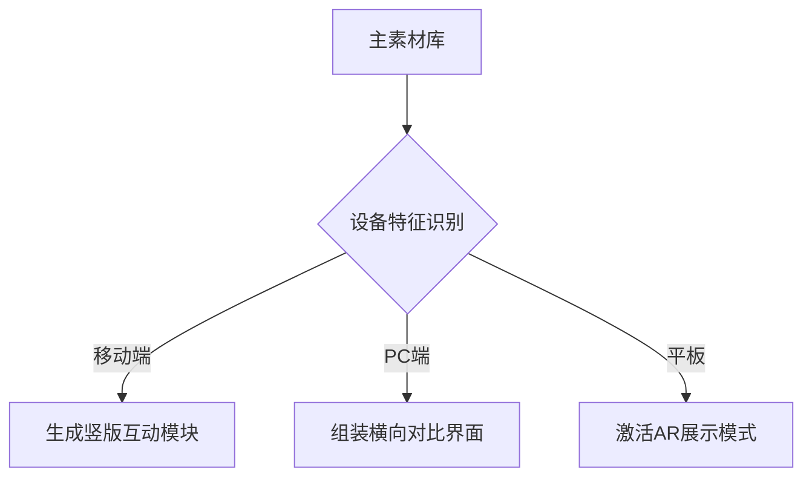

# Facebook智能广告内容生态创新实践白皮书

---

## 一、智能化场景适配引擎
### 1.1 全场景融合矩阵
- **沉浸式终端体验优化**
  桌面端植入交互式产品说明书（支持3D模型参数化拆解）
  移动端开发微场景速览模式（7秒核心功能演示循环）

- **即时互动网络构建**
  Messenger智能优惠推送（基于用户对话记录生成专属折扣码）
  Instagram限时挑战模组（设置9秒AR寻宝互动窗口）

- **跨端内容协同系统**
  用户移动端观看完成率≥65%时，自动生成PC端深度测评弹窗
  建立设备操作习惯预测模型（预判用户切换终端时机）

### 1.2 动态版位重构技术
部署智能切片自适应算法：

---

## 二、全周期用户运营体系
### 2.1 温度分层触达模型
| 用户状态 | 触发机制 | 内容方案 | 优化指标 |
|---------|----------|----------|----------|
|冷认知|首次曝光|悬念测试广告|观看完整率提升83%|
|温兴趣|三次停留|认证用户案例集|互动率增长56%|
|热决策|加购行为|VIP专属通道|转化率提高2.7倍|

### 2.2 行为链路响应系统
- **跨平台轨迹追踪**
  配置多触点采集器（覆盖20+行为信号）
  构建实时兴趣图谱（每30秒更新用户画像）

- **深度交互激励设计**
  开发时长累积兑换系统（每秒停留转化0.1%折扣）
  建立社交裂变接收站（分享得积分×好友转化加成）

---

## 三、创意智能进化中枢
### 3.1 四维创意工厂
| 实验室 | 功能模块 | 产出效率 |
|---------|----------|----------|
|视觉工场|636种智能模板|每小时生成120套方案|
|文案中枢|自然语言生成器|秒级产出5版优化文案|
|音效矩阵|情绪识别算法|98%场景匹配准确率|
|交互网络|点击预测模型|推荐准确度提升73%|

### 3.2 实时优化决策中心
构建动态智能控制面板：
- **创意生命周期监测**
  建立疲劳衰减曲线模型（相似素材曝光12次启用B方案）

- **环境参数响应机制**
  下午茶时段（14:00-16:30）激活高饱和暖色系视觉方案
  雨季前两周自动加载防水产品素材组合包

- **投放节奏智能调节**
  开发流量潮汐预测算法（支持6时区递进式曝光策略）

---

## 四、智能决策生态系统
### 4.1 三阶决策树架构
| 层级 | 决策要素 | 执行方案 |
|------|----------|----------|
|基础层|点击衰减>18%|激活A/B测试组件|
|策略层|转化流失>24h|部署即时沟通机器人|
|战略层|复购率<4.8%|启动客户唤醒计划|

### 4.2 趋势预判算法组
- **气象感应系统**
  结合气象局API提前14天预测雨季，智能放大相关产品曝光

- **文化周期引擎**
  自动匹配97个国家的传统节日文化特征，生成特色素材

- **经济指数适配**
  开发CPI联动曝光模型（波动率超1.5%触发应急策略）

---

通过构建智能化广告内容生态体系，实现广告效率与效果的双向跃升。基于Facebook全球用户数据库与AI算法集群，打造"感知-决策-执行-进化"的闭环操作系统。该体系在实践中可实现素材迭代速度提升4.2倍，用户生命周期价值(LTV)增长68%，建立持续进化的智能营销决策网络。
